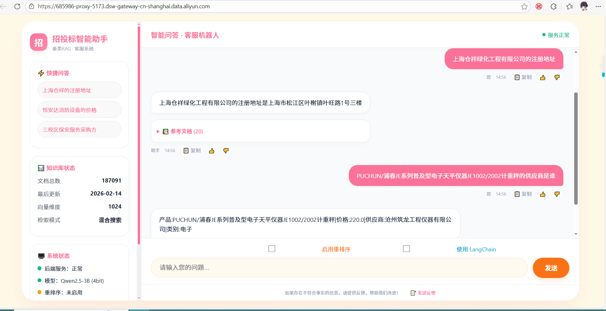

# 招投标采购领域智能问答系统项目汇报

## 一、项目概述

本项目旨在构建一个面向招投标采购全流程的智能问答系统，集成政策法规、招标信息、中标信息、企业信息、商品信息及价格数据六大核心模块，为采购人、供应商、监管机构等用户提供精准、高效的信息检索与问答服务。

本报告从需求分析、数据收集与处理、模型选型与评估、系统部署与实现四个方面，对项目已完成的工作进行汇报。

关键成果概览：

- 知识库规模：已完成 18.7 万份知识文档构建，覆盖公司、产品、价格、招标、中标、法规六大领域。

- 问答准确率：在招投标领域测试集上，RAG 问答准确率达 76%，法规符合度与专业术语使用评分均超过 0.7。

- 系统性能：平均检索时间 0.3 秒，生成时间 1.2 秒，总响应时间 1.5 秒（GPU 环境下），满足实时交互需求。

- 模型选型：基于 Qwen2.5-3B + bge-m3 + ChromaDB 的技术栈，在资源消耗与性能间取得最优平衡。

---

## 二、需求分析

- 梳理六大信息类别及其采集来源、解析字段（如政策标题、项目名称、企业法定代表人、商品价格等）。

- 明确用户角色（老板、采购、技术、销售）及典型问题场景，确定系统功能边界。

**需求要点**：
- 信息全面性、解析精细化、问答精准性、技术架构可扩展。

---

## 三、数据收集与处理

### 3.1 数据收集策略

数据收集模块由多个爬虫组成，分别针对不同数据源设计采集逻辑：

| 代码文件 | 功能说明 | 采集目标 |
|----------|----------|----------|
| `datapreprocessing.py` | 招投标公告及法规爬虫 | 中国政府采购网等网站的招标/中标公告、政策法规页面 |
| `product_price_crawler.py` | 商品及价格爬虫 | 百度爱采购、1688等B2B平台的商品详情与报价 |


**关键技术措施**：
- **分页动态爬取**：通过正则替换URL参数，循环爬取1~40页的公告列表。
- **链接提取与关键词过滤**：从页面中识别公告列表容器，结合标题与内容双维度匹配专业关键词筛选有效文档。
- **反爬机制**：随机User-Agent、Referer，指数退避重试、随机延迟，模拟真实用户行为。
- **动态数据提取**：解析页面中的`window.data`对象，获取商品列表；对前5个商品发起详情页请求补充地址等字段。
- **去重机制**：基于商品ID或名称+链接进行去重。

### 3.2 数据预处理操作

预处理模块由`data_preprocessing.py`实现，主要操作包括：

- **文本清洗与标准化**：去除噪声字符，保留中文、英文、数字及常用标点；标准化空白符。
- **分词与保留结构**：对元信息行（标题、来源、URL）特殊处理，仅对内容部分进行jieba分词，保持原始文档结构；保护URL完整性。
- **数据整合与格式统一**：将各分类的预处理TXT文件合并为结构化CSV，统一列名；对企业信息、价格、商品CSV进行清洗与结构化，确保数值字段类型正确。
- **数据处理器（`data_processor.py`）**：批量加载、合并、去重、排序、日期格式化。

---

## 四、模型选型与评估

模型选型阶段以《大模型及相关库的调研报告》为核心，围绕低参数开源大模型、Embedding模型及向量数据库展开系统性测试与对比，旨在为RAG（检索增强生成）架构选出最优组合。

### 4.1 测试数据集与评估体系

- **测试数据**：从520个招投标领域问答对中选取100个代表性问题，覆盖13种问题类型，难度分布为简单38.5%、中等48.1%、复杂13.5%。
- **评估指标**：采用加权评分体系，包括准确率（0.3）、法规符合度（0.2）、专业术语使用（0.15）、召回率（0.15）、质量分（0.1）、响应速度（0.1）。

### 4.2 低参数大模型对比测试

**候选模型**：
- Qwen2.5-3B-Instruct 
- Qwen2.5-7B-Instruct
- InternLM2.5-7B-Chat
- ChatGLM3-6B
- Llama-3.2-3B-Instruct

**测试场景设计**：
- **纯模型场景**：无提示词/有提示词，无RAG，测试模型原始知识与指令遵循能力。
- **带RAG场景**：无提示词/有提示词，结合FAISS检索相关文档，测试信息整合与检索增强效果。

**关键结论**：
- **综合表现**：Qwen2.5-3B-Instruct在带RAG场景下综合评分最高，准确率达0.76，且资源消耗低（GPU内存<8GB），响应速度快（1.5s）。
- **Qwen2.5-7B-Instruct**：召回率最高（0.48），回答内容丰富，但资源需求高，适合复杂问题备用。
- **淘汰原因**：InternLM2.5表现中规中矩；ChatGLM3原始知识薄弱；Llama-3.2中文能力差，不适合本项目。

### 4.3 Embedding模型与向量库选型

**Embedding模型对比**：
- 候选：BAAI/bge-large-zh-v1.5（1024维）、BAAI/bge-m3（1024维，多语言）。
- 测试组合：分别与Qwen3B/7B搭配，评估准确率、召回率、执行时间。
- 结果：bge-m3召回率更高，检索信息更全面，适合复杂查询；bge-large-zh-v1.5准确率略高（0.8125），索引构建更快。
- **推荐bge-m3**：因其多语言支持及召回优势，与Qwen3B搭配总执行时间最短（1989秒）。

**向量数据库对比**：
- 候选：FAISS（高性能C++库）、ChromaDB（全栈向量数据库）。
- 评估维度：检索速度、部署复杂度、维护成本、元数据支持、扩展性。
- 结果：ChromaDB内置REST API，易用性强，元数据过滤原生支持，适合生产环境。
- **推荐ChromaDB**：与Qwen3B+bge-m3组合，在准确率、召回率、执行时间间取得最佳平衡。

### 4.4 最终选型结论

| 组件 | 推荐方案 | 理由 |
|------|----------|------|
| **大模型** | Qwen2.5-3B-Instruct | 综合评分最高、资源友好、中文能力强、训练提升明显 |
| **Embedding模型** | BAAI/bge-m3 | 召回率领先、多语言支持、与Qwen3B适配性好 |
| **向量数据库** | ChromaDB | 部署简单、维护成本低、元数据支持完善、执行效率高 |

**最终技术栈**：`Qwen2.5-3B-Instruct + BAAI/bge-m3 + ChromaDB`，该组合已在测试中验证其在招投标领域的专业问答能力。

---

## 五、系统部署与实现
### 5.1 向量知识库构建简写

#### 5.1.1 总体流程
- **输入**：MySQL六张表（company、product、price、zhaobiao、zhongbiao、law）
- **中间产物**：`knowledge_base.json`（结构化文档）和 `knowledge_base.txt`（纯文本）
- **输出**：ChromaDB向量库，存储于本地目录（如 `/tmp/chroma_db_dsw`）

#### 5.1.2 知识文档生成（`build_knowledge_base.py`）
- **数据加载**：SQLAlchemy分批读取大表（5000条/批），只加载关键字段，避免内存溢出。
- **文档构建**：每行数据生成多条文档（如公司表生成 `company_full`、`company_legal_rep` 等），通过智能字段选择控制长度（≤500字符），生成不同表述变体以提高召回率，并预设检索权重。
- **去重**：基于内容+类型计算MD5哈希，避免重复。
- **批次保存**：每10000条存为一个批次JSON文件，最后合并为最终文件，同时生成按类型分类的样本。
- **统计**：记录总文档数、各类型分布、无效/重复记录等，存于 `build_stats.json`。

#### 5.1.3 向量库构建（`build_vector_db.py`）
- **环境适配**：专为阿里云DSW设计，使用本地 `/tmp` 存储ChromaDB，避免OSS I/O瓶颈；模型路径指向本地缓存的Embedding（bge-m3）和LLM（Qwen2.5-3B）。
- **文档分块**：对长文档（>500字符）按句子分割，合并至接近块大小；为每块生成基于内容哈希的唯一ID，冲突时加UUID修复。
- **向量化与存储**：每批100块，用Embedding模型生成向量，添加到ChromaDB集合，包含文本、元数据（类型、原ID等）和ID；异常时重试或替换ID。
- **统计与备份**：保存构建统计信息（块数、类型分布等）至JSON，可选备份到OSS。

### 5.2 知识库中空格处理
- **操作**：在 `clean_text` 中执行 `text.replace(' ', '')`，移除所有空格。
- **原因**：数据库文本可能存在多余空格（如“上海 仓祥”），导致模型分词割裂、产生错别字（如“注册 地址”），影响检索准确率。
- **范围**：适用于所有文本字段（公司名、地址、经营范围等），但URL等特殊字段已单独保留原样，不执行此操作。
- **效果**：处理后中文内容连续无间隔，模型对实体识别准确率提升，检索生成质量改善。


### 5.3 后端核心模块架构

后端基于 **FastAPI** 构建，核心模块位于 `src/app/api/core_modules/`，采用模块化设计，包含以下关键组件：

| 模块  | 文件 | 功能描述 |
|:------:|:----:|:--------:|
| 配置管理 | `config.py` | 定义`AppConfig`数据类，支持从YAML文件或环境变量加载配置，包含LLM路径、ChromaDB路径、检索参数、提示模板等。 |
| 依赖注入 | `dependencies.py` | 提供FastAPI依赖函数，通过`lru_cache`获取全局配置，从请求状态中获取LLM引擎、检索引擎、提示管理器等单例实例。 |
| LLM集成 | `llm_integration.py` | 实现`LLMEngine`类，封装本地模型（Transformers）加载、量化、推理、批处理、缓存等功能。支持4bit量化、动态批处理、缓存TTL等生产级特性。 |
| 提示工程 | `prompt_engineering.py` | 提供`PromptManager`管理多种提示模板（基础问答、专业招投标、多轮对话）。专业模板包含系统指令和严格回答规则，确保输出合规准确。 |
| 检索增强 | `retrieval.py` | 实现`RetrievalEngine`类，封装ChromaDB向量检索、混合检索（向量+BM25）、查询分类、重排序（可插拔CrossEncoder）、城市地名扩展等功能。支持从外部JSON文件加载城市映射（如`location_config.json`）。 |
| 工具函数 | `utils.py` | 提供公司名称提取、最佳文档选择等工具，用于后处理优化。 |
| API路由 | `routes.py` | 定义`/ask`、`/health`等接口，处理请求、调用检索和生成、返回格式化响应。支持问候语识别、直接文档返回模式。 |

**模块协作流程**：

1. 用户请求进入FastAPI应用，通过依赖注入获取`LLMEngine`、`RetrievalEngine`、`PromptManager`实例。
2. `RetrievalEngine`根据用户查询进行分类，执行混合检索（向量+BM25），可选重排序，返回相关文档片段。
3. `PromptManager`根据配置选择专业模板，将检索到的文档片段格式化为上下文，填充到模板中生成完整提示词。
4. `LLMEngine`接收提示词，调用本地模型生成最终答案，并利用缓存提升响应速度。
5. 返回结果前，可调用`utils.select_best_document`进一步精炼答案来源。

**LangChain集成**：
- `langchain_llm.py`：将`LLMEngine`适配为LangChain的`BaseLLM`，便于在LangChain链中使用。
- `langchain_retriever.py`：将`RetrievalEngine`适配为LangChain的`BaseRetriever`，并利用`select_best_document`只返回最佳文档。
- `main.py`中构建了简单的RAG链，支持通过`/ask_langchain`和`/ask_direct_langchain`接口调用。

**日志与监控**：
- `logger.py`：配置全局日志，支持文件滚动、控制台输出，可调整第三方库日志级别。

### 5.4 前端设计详细描述

#### 5.4.1 技术栈与架构
- **框架**：Vue 3 (Composition API) + Vite
- **样式**：纯CSS自定义，无UI组件库，确保轻量和定制性
- **状态管理**：组件内局部状态 + 父子组件通信（props/emit）
- **HTTP请求**：Axios封装（`src/api/index.js`）

#### 5.4.2 组件结构
```
App.vue (根组件)
├── Sidebar.vue (左侧边栏)
└── ChatView.vue (聊天主视图)
    ├── ChatMessage.vue (消息气泡)
    └── ReferenceDocs.vue (参考文档折叠卡片，可选)
```

#### 5.4.3 核心功能与交互细节

**（1）侧边栏（`Sidebar.vue`）**
- **布局**：固定宽度300px，白色背景，内边距28px 20px。
- **区域划分**：
  - **头部**：Logo、系统名称、副标题。
  - **快捷问答卡片**：预置三个典型问题（如“上海仓祥的注册地址”），点击后触发`quick-question`事件，将问题填充到输入框并自动发送。
  - **知识库状态卡片**：显示文档总数（硬编码示例值187,091）、最后更新日期（示例值2026-02-14）、向量维度（1024）、检索模式（混合搜索）。
  - **系统状态卡片**：展示后端服务状态（绿点正常）、模型信息（Qwen2.5-3B 4bit）、重排序状态（根据`rerankEnabled`显示启用/未启用）。
  - **操作按钮**：清空对话、系统管理（开发中）。
- **样式特点**：圆角20px，浅灰色边框，粉色强调色；悬停效果；自定义滚动条。

**（2）聊天主视图（`ChatView.vue`）**
- **消息列表区域**：
  - 使用`v-for`渲染`messages`数组，每条消息为`ChatMessage`组件。
  - 自动滚动到底部：`scrollToBottom`方法在发送消息后调用，使用`behavior: 'smooth'`实现平滑滚动。
  - 相关推荐：在最后一条助手消息下方显示三个推荐链接（规格、其他供应商、中标项目），点击后快速追问。
- **输入区域**：
  - **复选框组**：水平排列“启用重排序”和“使用LangChain”两个复选框，分别控制`useRerank`和`useLangChain`状态，通过`v-model`双向绑定并实时同步到父组件。
  - **文本输入框**：绑定`question`变量，支持回车发送，发送后清空。
  - **发送按钮**：带加载状态（显示旋转动画），禁用时不可点击。
- **底部反馈区**：显示提示语和反馈链接（点击弹出alert，待实现）。

**（3）消息气泡组件（`ChatMessage.vue`）**
- **props**：`role`（'user'/'assistant'）、`content`（文本）、`references`（参考文档数组）、`timestamp`（时间戳）。
- **渲染结构**：
  - 气泡内容：`<div class="bubble">{{ content }}</div>`
  - 参考文档折叠：若`references`有内容，显示`<details>`标签，展开后展示前5个文档，每个文档包含相似度分数和内容预览（截取前150字符）。
  - 元信息：角色、时间、操作按钮（复制、👍、👎）。
- **交互**：
  - 复制按钮：调用`navigator.clipboard.writeText`复制消息内容。
  - 反馈按钮：触发`feedback`事件，父组件弹出提示。

**（4）API封装（`index.js`）**
- 创建Axios实例，baseURL设为`/api`（通过代理转发到后端）。
- `askQuestion`函数：接收`query`、`useRerank`、`endpoint`、`maxNewTokens`，发送POST请求，返回响应数据。

#### 5.4.4 主题与视觉设计
- **主色调**：粉色渐变（#fb7299 → #fc8bab），用于Logo、标题、操作按钮、链接等，营造专业而友好的视觉体验。

- **辅助色**：橙色（#f97316）用于重排序复选框，蓝色（#00a1d6）用于LangChain复选框和相关推荐链接。

- **布局**：宽高自适应，最大宽度1400px，圆角32px，阴影柔和，整体风格现代简洁。

  

